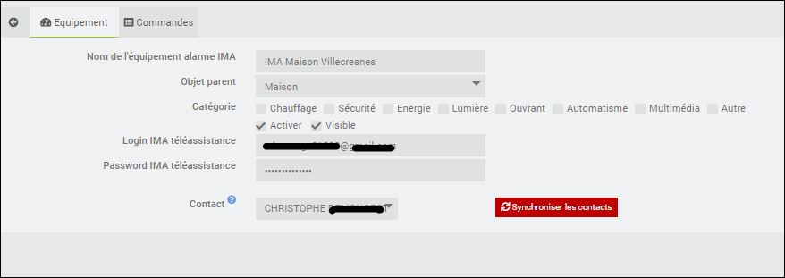
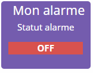

Description
===
Ce plugin permet  : 
- afficher le statut de votre alarme IMA téléassistance
- modifier le mode de l'alarme
-- activer le mode total
-- activer le mode partiel
-- desactiver de l'alarme
- visionner les prises de photos
- supprimer les prises de photos

Prérequis
---
Vous devez tout d'abord activer l'option "Pilotage à distance" de votre alarme.
Ceci peut se faire gratuitement en appelant IMA téléassistance.
Vous obtiendrez alors un login/mot de passe d'accès au site: https://www.imaprotect.com/fr/ .

 
Création de l'alarme
---
Une fois le plugin installé:

- cliquez sur Plugins > Sécurité > Alarme IMA
- puis cliquez sur l'icône "+"
- dans la fenêtre qui s'ouvre, choisissez un nom d'équipement, par exemple: "Mon alarme".
- vous arrivez alors à la page de configuration de votre alarme:

> Le login / mot de passe à configurer ici est celui qui vous permet d'accéder à https://www.imaprotect.com/fr/ (voir section Prérequis). Ces identifiants sont stockés uniquement dans votre jeedom et servent à récupérer le statut de l'alarme.

- cliquez sur Sauvegarder.
- choissez le contact à utiliser

> le contact va permettre au plugin de faire un contrôle, lors de l'arrêt de l'alarme, entre le mot de passe XO du contact et le mdp saisie lors de la demande d'arrêt

> **Important**
>
> Pensez à
> - choisir un objet parent,
> - cliquer sur activer,
> - cliquer sur visible.
>
> Sans ces 3 conditions, vous ne verrez pas votre alarme sur le dashboard jeedom.

Voir le statut de l'alarme
---
Cliquez maintenant sur Accueil > Dashboard : un nouveau widget apparaît, qui représente le statut actuel de l'alarme.

3 statuts sont possibles:
- ON (l'alarme est en marche), 
- OFF (l'alarme est éteinte), 
- PARTIAL (l'alarme est active sur une partie de votre domicile uniquement).

Activer / Desactiver l'alarme
---

Journal des évènements
---
Dès que IMA aura remis la fonctionnalité disponible

Historique des prises de vue
---
Permet de :
- consulter un prise de vue
- supprimer une prise de vue

Prendre un instantané
---
Dès que IMA aura remis la fonctionnalité disponible

Liste des commandes d'un équipement "Alarme_IMA"
---

FAQ
===
Que deviennent mes identifiants saisis ?
---
Ils sont simplement stockés sur votre Jeedom pour pouvoir récupérer le statut de l'alarme.

Pourquoi le statut de mon alarme met-il du temps à se mettre à jour ?
---
Le statut de l'alarme est mis à jour toutes les minutes par jeedom. Il faut donc attendre jusqu'à une minute pour voir le statut changer.

Le statut de l'alarme peut-il être historisé ?
---
Par défaut, le statut de votre alarme est historisé. Vous pouvez consulter l'historique en cliquant sur "Statut alarme" sur le widget de votre alarme sur le dashboard jeedom:
  * la valeur 0 signifie que l'alarme était éteinte,
  * la valeur 2 signifie qu'elle était allumée,
  * la valeur 1 que l'alarme couvrait une partie de votre domicile.
  * la valeur -1 signifie qu'il y a eu une erreur technique sur le site pilotageadistance.imateleassistance.com au moment de la récupération du statut.

Comment supprimer l'historisation de l'alarme ?
---
Depuis l'écran de configuration de votre alarme, cliquez sur Commandes, et décochez la case "Historiser".

