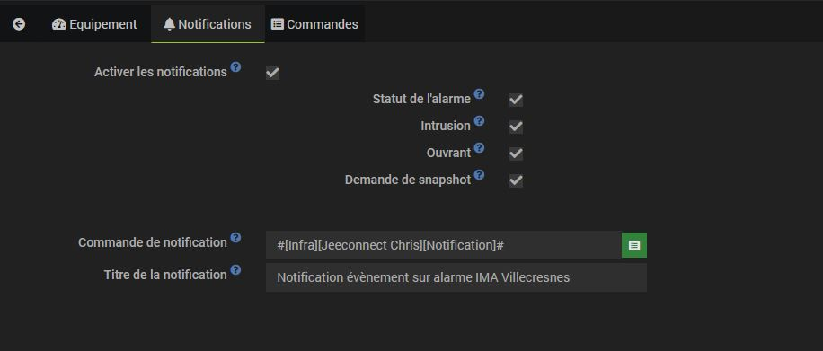

Description
===
Ce plugin permet  : 
* afficher le statut de votre alarme IMA téléassistance
* modifier le mode de l'alarme
	+ activer le mode total
	+ activer le mode partiel
	+ desactiver de l'alarme
* visionner les prises de photos
* supprimer les prises de photos
* prendre des snapshots via les cameras IMA
	+ envoyer la photo prise par notification
* consulter la liste des évènements de l'alarme
* envoyer des notifications en fonction des évènements de l'alarme (envoi lié à la fréquence du cron)

Prérequis
---
Vous devez tout d'abord activer l'option "Pilotage à distance" de votre alarme.
Ceci peut se faire gratuitement en appelant IMA téléassistance.
Vous obtiendrez alors un login/mot de passe d'accès au site: https://www.imaprotect.com/fr/ .

Cron
---
Le plugin vous offre la possibilité de choisir le cron de MAJ du statut de l'alarme au travers de la page d'activation du plugin.

Un cron toutes les heures est executé automatiquement pour récupérer l'historique des prises de vue

Un cron tous les jours est executé pour supprimer les snapshots de plus de 10 jours

Création de l'alarme
---
Une fois le plugin installé:

- cliquez sur Plugins > Sécurité > Alarme IMA
- puis cliquez sur l'icône "+"
- dans la fenêtre qui s'ouvre, choisissez un nom d'équipement, par exemple: "Mon alarme".
- vous arrivez alors à la page de configuration de votre alarme:

> Le login / mot de passe à configurer ici est celui qui vous permet d'accéder à https://www.imaprotect.com/fr/ (voir section Prérequis). Ces identifiants sont stockés uniquement dans votre jeedom et servent à récupérer le statut de l'alarme.

- cliquez sur Sauvegarder.
- choissez le contact à utiliser
- supprimer les données de sessions (jetons, etc ...)

> le contact va permettre au plugin de faire un contrôle, lors de l'arrêt de l'alarme, entre le mot de passe XO du contact et le mdp saisie lors de la demande d'arrêt

> **Important**
>
> Pensez à
> - choisir un objet parent,
> - cliquer sur activer,
> - cliquer sur visible.
>
> Sans ces 3 conditions, vous ne verrez pas votre alarme sur le dashboard jeedom.

Gestion des notifications en fonction des évènements de l'alarme
---

- activer les notifications
- chosissez sur quels évènements vous souhaitez être notifié 
-- Activation / désactivation
-- intrusion
-- ouvrant ouvert et alarme activée
-- demande de snapshot
- sélectionnez la commande notification utilisée par le plugin pour envoyer la notification
- choisissez le titre de la notification

 
Widget Alarme IMA
===
Le widget s'articule autour de 4 onglets : 
- statut de l'alarme 
- journal des évènements
- journal des prises de vue
- prise de vues

Et d'un radio bouton permettant de modifier le mode de l'alarme (total, partiel ou désactivé)

Voir le statut de l'alarme
---
Cliquez maintenant sur Accueil > Dashboard : un nouveau widget apparaît, qui représente le statut actuel de l'alarme.

3 statuts sont possibles:
- ON (l'alarme est en marche), 
- OFF (l'alarme est éteinte), 
- PARTIAL (l'alarme est active sur une partie de votre domicile uniquement).

Activer / Desactiver l'alarme
---

La désactivation de l'alarme ouvre une fenêtre pour saisir le mot de passe de validation (code XO du contact sélectionné dans la configuration de l'équipement)

Journal des évènements
---

Historique des prises de vue
---

Permet de :
- consulter un prise de vue

- supprimer une prise de vue en cliquant sur la corbeille

Prendre un instantané
---
- il suffit d'aller dans l'onglet Snapshot ... de sélectionner la caméra et de cliquer sur "Prendre instantané"

- le résultat s'affiche entre 20 et 30s après (le temps que l'image soit disponible)

La liste des caméras est MAJ à chaque renouvellement de session IMA ... max toutes les 7 minutes.

La liste des caméras est ajouter à la configuration de la commande "Actions sur une image caméra".

Liste des commandes d'un équipement "Alarme_IMA"
---

 * commande de type info
	* Statut de l'alarme
	* Images caméras : historique des prises de vue (format html)
	* Images caméras données brutes : flux JSON de l'api IMA => permet de traiter l'information comme on le souhaite
	* Evenements : historique des évènements de l'alarme (format html)
	* Evenements données brutes  : flux JSON de l'api IMA => permet de traiter l'information comme on le souhaite
	* Dernière image snapshot : contient l'image en base64 issu de le dernière demande de snapshot d'une commande action caméra spécifique

 * commande de type action
	* Rafraîchir statut caméra : permet de forcer le rafraichissement de l'état d'activatio de l'alarme
	* Rafraichir capture caméras : permet de forcer le rafraichissement des captures de caméras
	* Rafraichir évènements alarme : permet de forcer le rafraichissement de la liste des évènements de l'alarme
	* Action mode alarme : commande de type message
		* Désactiver alarme :
			* title : off
			* message : le mot de passe XO du contact sélectionné dans la configuration de l'équipement
		* Mode partiel :
			* title : partial
			* message : vide
		* Mode total :
			* title : on
			* message : vide

	* Actions sur imaga caméra :
		* Récupérer une image :
			* title : get
			* message : url de l'image (disponible dans le flux brute)
		* Supprimer une image :
			* title : delete
			* message : primary key (pk) de la photo (disponible dans le flux brute)
		* prendre une snapshot d'une caméra :
			* title : take
			* message : primary key (pk) de la pièce (disponible dans la configuration de la commande action sur les images)
				* exemple de valeur de configuration : {"listValue":"1870|garage;1871|s\u00e9jour"}
					* la pk pour la pièce garage est 1870
					* la pk pour la pièce séjour est 1871
		* une commande action est générée automatiquement par pièce disposant d'une caméra
			* nom de la commande : Snapshot camera %nomDeLaPiece%

FAQ
===
Que deviennent mes identifiants saisis ?
---
Ils sont simplement stockés sur votre Jeedom pour pouvoir récupérer le statut de l'alarme.

Pourquoi le statut de mon alarme met-il du temps à se mettre à jour ?
---
Le statut de l'alarme est mis à jour toutes les minutes par jeedom. Il faut donc attendre jusqu'à une minute pour voir le statut changer.

Le statut de l'alarme peut-il être historisé ?
---
Par défaut, le statut de votre alarme est historisé. Vous pouvez consulter l'historique en cliquant sur "Statut alarme" sur le widget de votre alarme sur le dashboard jeedom:
  * la valeur 0 signifie que l'alarme est désactivée,
  * la valeur 2 signifie que l'alarme est activée en mode total,
  * la valeur 1 que l'alarme est activée en mode partiel.

Comment supprimer l'historisation de l'alarme ?
---
Depuis l'écran de configuration de votre alarme, cliquez sur Commandes, et décochez la case "Historiser".

